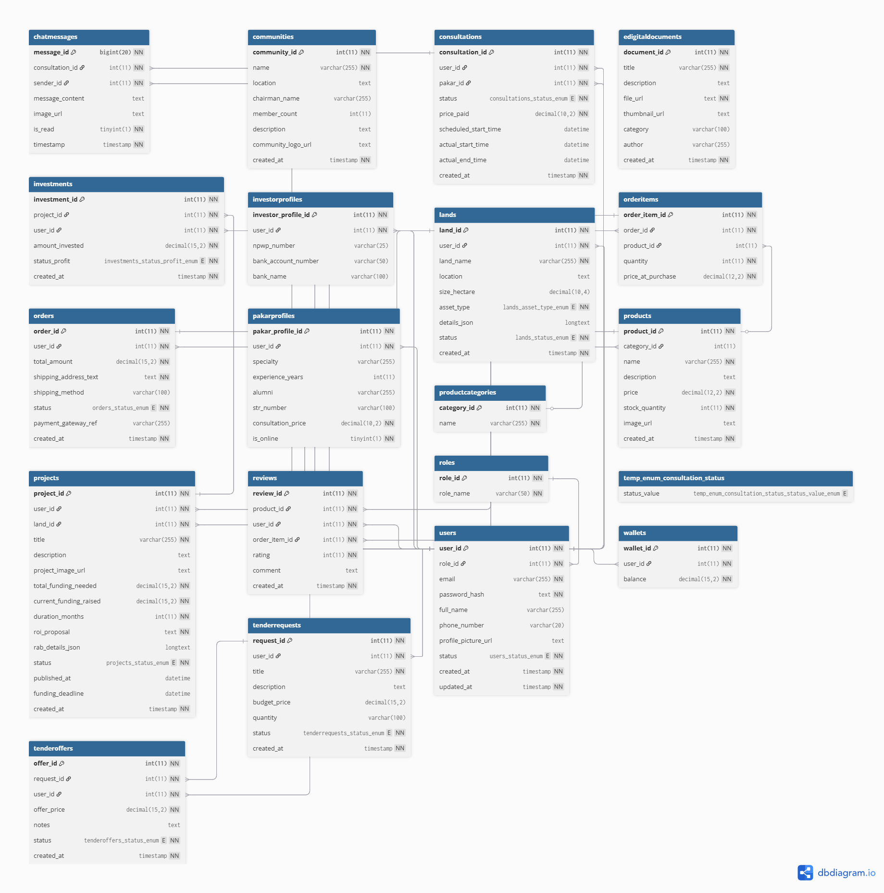

# GENTA - Aplikasi Agrikultur dan Peternakan (Regional Super-App Ecosystem)

[](https://opensource.org/licenses/MIT)
[](https://flutter.dev)
[]()
[]()

**GENTA** (Klinik Tani) adalah sebuah ekosistem **Agri-Tech** skala regional yang dirancang komprehensif untuk mengatasi tiga masalah utama di sektor pertanian dan peternakan di Indonesia: **permodalan, pasar, dan dukungan ahli**.

> **Catatan Pengembang:** Versi ini adalah **High-Fidelity Prototype (MVP)**. Aplikasi berjalan sepenuhnya dengan simulasi alur bisnis (*Business Process*) menggunakan **Mock Data Repository** dan arsitektur modular yang siap dihubungkan dengan backend production.

---

## 💡 Fitur & Ekosistem (Ecosystem Features)

Aplikasi GENTA dibangun sebagai *Super-App* yang melayani berbagai peran pengguna dalam satu platform terintegrasi:

### 1. Pendanaan (Crowdfunding & Investment)
* **Petani:** Mengajukan proposal pendanaan modal kerja (bibit, pupuk) dengan verifikasi aset lahan.
* **Investor:** Marketplace proyek transparan untuk menelusuri, menganalisis ROI, dan mendanai proyek pertanian nyata.

### 2. Pasar (Integrated Marketplace)
* **Toko (E-commerce):** Pembelian sarana produksi pertanian (saprotan) secara online dengan sistem keranjang dan tracking pengiriman.
* **Kebutuhan (Tender Jasa):** Sistem lelang jasa dimana petani memposting kebutuhan (sewa traktor, tenaga panen) dan penyedia jasa memberikan penawaran (*bidding*).

### 3. Dukungan Ahli (Telemedicine Tani)
* **Klinik & AI Scan:** Deteksi dini penyakit tanaman via kamera (Simulasi AI) dan konsultasi langsung via Chat/Video Call dengan Pakar terverifikasi.
* **Perpustakaan Digital:** Akses panduan dan literasi pertanian modern.

---

## ⚙️ Arsitektur Kode (Scalable Architecture)

Project ini dibangun dengan prinsip **Clean Architecture** dan **Feature-First Modularization** untuk memastikan skalabilitas kode dalam pengembangan jangka panjang.

```text
lib/app/
├── modules/               # Modul Fitur (UI, Controller, Binding)
│   ├── 00_core_auth       # Multi-role Auth & KYC
│   ├── 01_main_navigation # Dashboard & Routing Manager
│   ├── 02_clinic_support  # Telekonsultasi & AI
│   ├── 03_store_ecommerce # Toko & Transaksi
│   ├── 04_tender_needs    # Sistem Lelang Jasa
│   ├── 05_funding         # Crowdfunding System
│   └── 06_profile_wallet  # E-Wallet & Account Mgmt
├── data/
│   ├── models/            # Data Models
│   └── repositories/      # Repository Pattern
│       ├── abstract/      # Contracts/Interfaces
│       └── implementations/ # Mock Implementation (Switchable to Real API)

```

---

## 🛠️ Teknologi (Technology Stack)

### Implementasi Saat Ini (Current MVP Stack)

| Kategori | Teknologi | Deskripsi |
| --- | --- | --- |
| **Framework** | **Flutter** | Pengembangan lintas platform (iOS & Android). |
| **State Management** | **GetX** | Manajemen state reaktif, routing, dan dependency injection. |
| **UI Components** | `flutter_chat_ui`, `introduction_screen` | Komponen antarmuka modern dan interaktif. |
| **Data Source** | **Mock Repository** | Simulasi data lokal (*In-Memory*) untuk demonstrasi alur bisnis tanpa server. |
| **Utilities** | `flutter_animate`, `intl`, `image_picker` | Animasi UI, format mata uang/tanggal, dan akses kamera. |

### Rencana Skala Produksi (Planned Production Stack)

| Kategori | Teknologi | Deskripsi |
| --- | --- | --- |
| **Database** | **PostgreSQL** | Database relasional utama untuk backend. |
| **Backend** | Go / NestJS | RESTful API untuk menangani *high-concurrency request*. |
| **Real-time** | WebSocket / Firebase | Untuk fitur Chat dan Notifikasi live. |
| **Payment** | Midtrans / Xendit | Payment Gateway untuk transaksi pendanaan dan toko. |
| **Video Call** | Agora.io | SDK untuk fitur telekonsultasi tatap muka. |

---

## 📊 Desain Basis Data (Database Design - PostgreSQL)

Skema basis data GENTA diimplementasikan menggunakan **PostgreSQL** (sebagai desain target production), yang dipilih karena dukungan yang kuat untuk fitur-fitur lanjutan seperti tipe data `JSONB` dan tipe data kustom (`ENUM`s) untuk menjaga integritas data status.

### Entitas Kunci dan Fungsionalitas

Struktur ini mendukung semua modul utama aplikasi:

1. **Pengguna & Peran:**
* Tabel **`users`** dan **`roles`** mengelola Petani, Investor, Pakar, dan Admin.
* Tabel **`investorprofiles`** dan **`pakarprofiles`** menyimpan detail spesifik untuk masing-masing peran.


2. **Pendanaan (Crowdfunding):**
* Tabel **`lands`** mencatat aset petani yang diverifikasi (Land Asset).
* Tabel **`projects`** mencatat proposal pendanaan yang diajukan.
* Tabel **`investments`** mencatat kontribusi dari Investor ke proyek.


3. **Marketplace & Tender:**
* Tabel **`products`** dan **`productcategories`** untuk modul e-commerce (Toko).
* Tabel **`orders`** dan **`orderitems`** untuk mencatat transaksi pembelian.
* Tabel **`tenderrequests`** dan **`tenderoffers`** untuk modul layanan/jasa (Kebutuhan).


4. **Dukungan (Klinik & Perpustakaan):**
* Tabel **`consultations`** mencatat sesi konsultasi terjadwal/terlaksana.
* Tabel **`chatmessages`** menyimpan riwayat komunikasi konsultasi.
* Tabel **`edigitaldocuments`** untuk Perpustakaan Digital.


5. **Keuangan:**
* Tabel **`wallets`** untuk mengelola saldo dan transaksi internal setiap pengguna.


### Relasi Utama dan Tipe Data Kustom

Skema ini memanfaatkan Foreign Keys (`REFERENCES`) untuk memastikan konsistensi data. Beberapa tipe data kustom (`ENUM`) yang digunakan mencakup:

* `consultation_status`
* `investment_profit_status`
* `asset_type`, `asset_status`
* `order_status`
* `project_status`
* `offer_status`, `tender_status`
* `user_status`

*Visualisasi Entity-Relationship Diagram (ERD) GENTA.*


---

## 💻 Instalasi dan Pengujian (Installation & Testing)

Aplikasi ini dirancang *Plug-and-Play*. Anda tidak perlu melakukan konfigurasi backend atau API Key untuk menjalankannya.

### 1. Persiapan

Pastikan Anda telah menginstal **Flutter SDK** (versi 3.x) dan **Dart**.

```bash
# Clone repository
git clone [https://github.com/IlhamRichie/Sobat-Genta-App.git](https://github.com/IlhamRichie/Sobat-Genta-App.git)

# Masuk ke direktori
cd sobatgenta

# Install dependencies
flutter pub get

# Jalankan aplikasi
flutter run

```

### 2. Akun Demo (Mock Credentials)

Gunakan akun berikut untuk masuk dan menguji alur bisnis dari berbagai perspektif peran pengguna:

| Peran (Role) | Email | Password | Fitur Utama |
| --- | --- | --- | --- |
| **Petani** | `petani@genta.com` | `password123` | Ajukan Dana, Belanja, Konsul, Buat Tender |
| **Investor** | `investor@genta.com` | `password123` | Jelajah Proyek, Investasi, Cek Portofolio |
| **Pakar** | `pakar@genta.com` | `password123` | Terima Konsultasi, Atur Jadwal |

---

**Developed with ❤️ by Ilham Richie**
*Membangun Masa Depan Pertanian Indonesia*